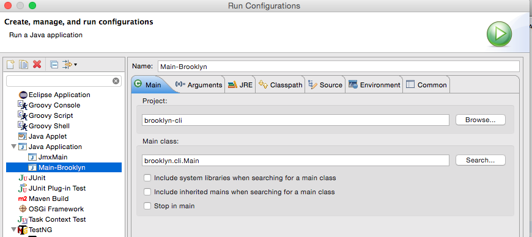
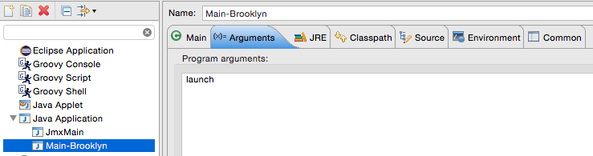
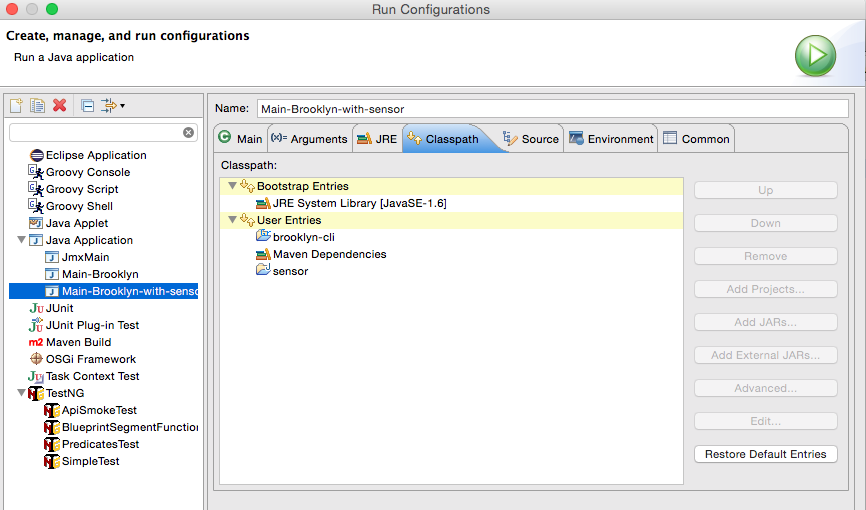

# A sensor for Brooklyn - an example

The idea is to build a Brooklyn sensor which makes use of JMX.

Either build this project and drop the jar file in ??? (look up where this was again)

Or, import Brooklyn in your IDE and set up the following run config:

Then, import this project in your IDE and add it in your classpath in your run configuration:

Now you should be able to launch Brooklyn and get this project's built artifacts on your classpath.

---

After Brooklyn starts, go to localhost:8081 (or some other port as indicated in stdout), and add the YAML deployment descriptor found in tmp/blueprint.yaml

---

Notes:
  * If you want to have Brooklyn download Mule again in the install, you need to make sure you delete the file BROOKLYN in install.dir.
    * There is this test in the install script generated: test -f BROOKLYN && exit 0

